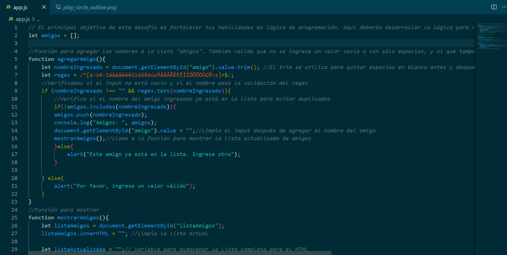

# 🎁 Amigo Secreto

> Una aplicación simple en JavaScript, HTML y CSS para realizar un sorteo de amigo secreto de manera interactiva.

## 🚀 Tecnologías utilizadas


## 📌 Descripción

Este proyecto permite agregar nombres a una lista de amigos y luego realizar un sorteo aleatorio para seleccionar al "amigo secreto".

## 📜 Características

✅ Validación para evitar nombres vacíos o repetidos.
✅ Interfaz simple e interactiva.
✅ Sorteo aleatorio.
✅ Sortea la misma lista de amigos las veces que quieras.
✅ Agrega nuevos nombres a la misma lista.
✅ Botón para nuevo juego

## 📂 Estructura del Proyecto

```
Challenge-Amigo Secreto/
│── index.html
│── style.css
│── app.js
│── README.md
└── assets/
    └── amigo-secreto.png
    └── play_circle_outline.png
    └── vista-de-la-app.png
```

## 🎮 Uso

1. Ingresa los nombres de los participantes y agrégalos a la lista.
2. Haz clic en el botón de sorteo para seleccionar al "Amigo Secreto".
3. Sigue aprentando "Sortear amigo" o seguir agregando nombres nuevos a la lista.
4. Para jugar de nuevo aprieta el botón "Nuevo Juego" 

## 📸 Captura de pantalla



## 🛠 Cómo ejecutar el proyecto

1. Clona este repositorio:
   ```sh
   git clone https://github.com/maximerlo/amigo-secreto-alura.git
   ```
2. Abre el archivo `index.html` en tu navegador.

## 📌 Contribución

Si deseas contribuir, siéntete libre de hacer un fork del proyecto y enviar un pull request.


## 🧑‍💻 Autores
### Carlos Maximiliano Merlo


Soy un desarrollador apasionado por aprender nuevas tecnologías y compartir conocimientos.

### Alura Latam


AluraLatam es una plataforma educativa que ofrece cursos online para el desarrollo de habilidades técnicas y profesionales.

## 📄 Licencia

Este proyecto está bajo la licencia MIT.

---

💡 *¡Diviértete sorteando el amigo secreto!* 🎉


